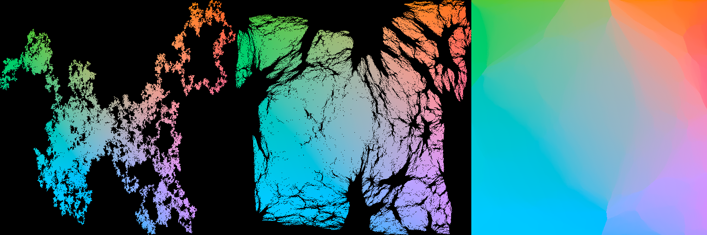

# megalap

`megalap` assigns large 2D point clouds to regular grids: every point gets its own grid cell, and the total squared movement is nearly minimal. It is a Python package with a native C++ core and `nanobind` bindings.

The main use case is turning embeddings (UMAP, t-SNE, Isomap) into image atlases: millions of points, one thumbnail per cell, no overlap.

The public API is three functions:

1. `snap_to_grid(points, ...)` — the high-level entry point
2. `window_cleanup(points, initial_assignment, rows, cols, ...)` — the multiscale solver behind it
3. `linear_sum_assignment(cost_matrix)` — a native dense square Jonker-Volgenant solver

## How it works

`megalap` never builds the `n x n` cost matrix that makes exact dense assignment infeasible at scale (a million points would need 7.3 TiB). Instead it starts from a trivial legal assignment and repeatedly solves exact linear assignment problems inside small windows of the grid — at multiple scales.

A window is at most `6x6` cells. At stride 1, windows cover contiguous cells and fix local defects. At stride `s`, the same windows cover every `s`-th cell, so one exact `36`-cell solve can move points all the way across the grid. One coarse-to-fine sweep (stride halving from grid-spanning down to 1, like the gap sequence in shell sort) repairs global structure in a handful of rounds; stride-1 rounds then polish until the budget expires or nothing changes.

Properties:

- **Anytime and monotone.** The assignment is legal after every round and the cost never increases.
- **Self-seeding.** The default seed is a deterministic random permutation: it reaches a fraction of a percent above the exact optimum in a few rounds, and converges lower and faster than any sorted seed we tested.
- **Linear memory.** No global cost matrix, ever.
- **Parallel.** All windows in a phase are disjoint and solved on native C++ threads.
- **Holes are free.** If `n < width * height`, unfilled cells drift to where they least distort the layout (window solves are rectangular). No padding or ghost points.

## Showcase

`512x512` meandering point cloud, rendered as a three-panel hero image on a black background:

1. the initial point cloud
2. a `50%` interpolated view
3. the final grid

All three panels use the same Lab-derived coloring with source `x/y` mapped into `a/b`.



## Install

From PyPI:

```bash
python -m pip install megalap
```

From a local checkout:

```bash
python -m pip install -e .
```

## API

### `snap_to_grid(points, width=None, height=None, cleanup_seconds=None, window_size=6, margin=0.03, num_threads=None, mask=None)`

Assign a 2D point cloud to distinct cells of a regular grid.

- `points`: `(n, 2)` float64 array-like
- `width`, `height`: destination grid; omitted, a near-square grid with aspect ratio in `[1:1, 2:1]` is chosen (an exact factorization of `n` when one exists, otherwise a slightly larger grid — leftover cells simply stay empty)
- `cleanup_seconds`: optional wall-clock cap; by default cleanup runs until it converges (no window can improve the assignment); `0.0` returns the raw seed (a deterministic random permutation; a random cell subset when the grid has more cells than points)
- `mask`: optional `(height, width)` bool array restricting which cells may be used, e.g. to shape the atlas or place the empty cells by hand
- `num_threads`: `None` uses all hardware threads

Returns:

- `grid_points`: `(n, 2)` float64 array of assigned grid positions, in input order
- `assignment`: `(n,)` int64 array of destination cell ids (`row * width + col`)
- `(width, height)`: the destination grid size

### `window_cleanup(points, initial_assignment, rows, cols, budget_seconds=None, window_size=6, margin=0.03, num_threads=None, fixed_suffix_count=0, strides=None, trace_rounds=False, cell_mask=None)`

Improve any legal assignment with multiscale window cleanup.

- `points` may number fewer than `rows * cols`; unassigned cells act as movable holes
- `budget_seconds=None` runs until converged (a full stride-1 round changes nothing)
- `strides=None` uses `default_stride_schedule(rows, cols, window_size)`: one round per stride, coarse to fine, then stride 1 repeats. Pass a custom list of strides (ints or `(row, col)` pairs) to override; the last entry repeats.
- `fixed_suffix_count` keeps a suffix of target cells locked; `cell_mask` marks which cells may be used at all
- `trace_rounds=True` adds per-round `round_elapsed_s`, `round_costs`, `round_strides` arrays to the result

Returns a dict with `assignment`, `rounds_completed`, `elapsed_s`, `final_cost`, and `converged`.

### `linear_sum_assignment(cost_matrix)`

Solve a dense square LAP exactly with the native C++ Jonker-Volgenant implementation. Useful for small problems and for auditing `window_cleanup` results.

Returns `(row_ind, col_ind, total_cost)`.

## Example

```python
import numpy as np
import megalap

points = np.random.default_rng(0).random((100_000, 2))
grid_points, assignment, (width, height) = megalap.snap_to_grid(points)
```

See [examples/basic_usage.py](examples/basic_usage.py) for a rendered example:

```bash
python -m pip install -e '.[examples]'
python examples/basic_usage.py
```

The showcase image above was generated with:

```bash
python examples/render_showcase.py \
  --grid-width 512 \
  --grid-height 512 \
  --image-width 512 \
  --image-height 512 \
  --cleanup-seconds 30 \
  --output assets/showcase_triptych_512.png
```

For release instructions, see [PUBLISHING.md](PUBLISHING.md).

## Notes

- `linear_sum_assignment()` expects a square cost matrix.
- The cleanup kernel uses windows of at most `6x6`, so the native small-LAP kernel is specialized for up to `36` cells per window; window solves are rectangular when holes are present.
- The native cleanup kernel uses standard C++ threads and does not depend on OpenMP.
- With `budget_seconds=None` (run to convergence), assignments are deterministic for fixed inputs and parameters, independent of thread count. With a finite budget, the number of completed rounds can vary with machine load.
- GitHub Actions builds release artifacts for Linux, macOS, and Windows wheels, plus an sdist.
